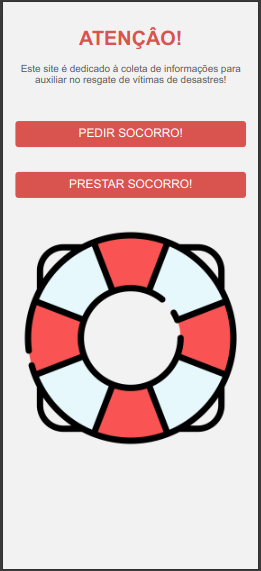

## SOCORRO APP

**Descrição:**

Este é um aplicativo web para auxiliar na coordenação e comunicação durante situações de desastre, com foco em facilitar o resgate de pessoas e animais afetados.

**Funcionalidades:**

* **Cadastro de solicitações de resgate:**
    * Permite que pessoas em situação de emergência solicitem resgate para si mesmas, familiares ou animais.
    * A solicitação inclui informações como localização, número de pessoas e animais, necessidades especiais e outras informações relevantes.
* **Gerenciamento de solicitações:**
    * Equipe de resgate pode visualizar e gerenciar as solicitações.
* **Mapeamento e visualização:**
    * Integração com mapas para visualizar a localização das solicitaçõese.

**Tecnologias:**

* **Front-end:** HTML, CSS e JavaScript
* **Back-end:** Node.js, Express.js e MySQL
* **Mapeamento:** Google Maps
* **Gerenciamento de projeto:** Git e GitHub

**Contribuições:**

Se você tiver interesse em contribuir para este projeto, você pode:

* **Criar issues:** Descreva problemas ou sugestões de melhorias para o aplicativo.
* **Enviar pull requests:** Contribua com código para corrigir bugs, adicionar novas funcionalidades ou melhorar o código existente.
* **Participar de discussões:** Compartilhe suas ideias e colabore com a comunidade de desenvolvedores.

**Licença:**

Este projeto está licenciado sob a licença [MIT](https://choosealicense.com/licenses/mit/).
